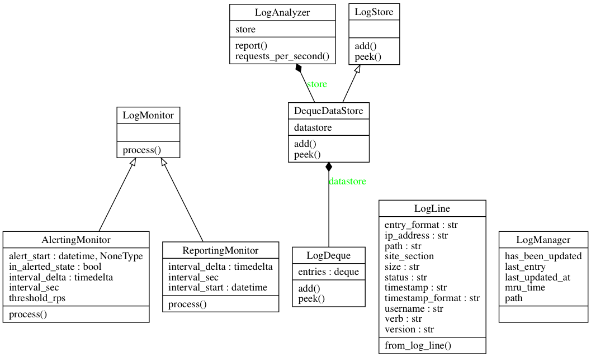

access_log_monitor
==================

A CLI and framework for monitoring a log file. Consumes an actively-written to
log and generates summary statistics and high-traffic alerts.

Provides sensible defaults but designed for flexibility:

- Defaults to reading `/var/log/access.log` (overridable from the command line)

- Defaults to issuing a high-traffic alert when traffic exceeds 10 requests per
  second over the past 2 minutes (both values overridable from the command line)

- Defaults to generating traffic summary statistics every 10 seconds
  (interval overridable from the command line)

- Defaults to using an in-memory data store (overridable, alternatives not yet
  implemented. see: [LogStore](access_log_monitor/log_store.py))

- Defaults to using a simple analysis engine (overridable, alternatives not yet
  implemented. see: [LogAnalyzer](access_log_monitor/log_analyzer.py))

- Defaults to the aforementioned alerts but these are easily extensible to other
  "monitors". (see: [log_monitors](access_log_monitor/log_monitors))


<!-- markdown-toc start - Don't edit this section. Run M-x markdown-toc-refresh-toc -->
**Table of Contents**

- [access_log_monitor](#accesslogmonitor)
    - [Running the CLI](#running-the-cli)
    - [Development](#development)
    - [Testing](#testing)
    - [Demo](#demo)
    - [Sample Output](#sample-output)
    - [Design notes](#design-notes)
        - [Class hierarchy](#class-hierarchy)
    - [Possible improvements](#possible-improvements)

<!-- markdown-toc end -->

Running the CLI
---------------

Issue `./monitor_access_log`.
To see the available flags, issue `./monitor_access_log --help`.

Development
-----------

This project uses [Pipenv][pipenv] for dependency management. See the
[Pipfile](Pipfile) for a dependency list.

[pipenv]: https://pipenv.readthedocs.io/

Issue the following from the project root to get started:

```
pipenv shell
pipenv install
```

Testing
-------

To run automated unit and integration tests with pytest:

```
pipenv run test
```

For static type checking:

```
pipenv run mypy
```


Demo
----

For a preconfigured demonstration, issuing the following command

```
pipenv run smoketest
```

will watch a log written to by

```
pipenv run log
```

Issue the latter in multiple terminals or tmux windows/panes to increase the hit
rate.

Alternatively, build the project using Docker Compose:

```
docker-compose up
```

Sample Output
-------------

Traffic summaries and alerts are printed to stdout.

```
% pipenv run smoketest

[INFO] Monitoring access log at data/testlog.log

[ALERT] High traffic generated an alert - hits/sec: 1.0, triggered at 2018-09-11 16:19:34+00:00.

Traffic Summary 2018-09-11 16:19:39+00:00
---------------------------
most_popular_section: pages
most_popular_count: 21
requests_processed: 71
requests_per_second: 2.4
response_2xx_pct: 43.7
response_3xx_pct: 25.4
response_4xx_pct: 12.7
response_5xx_pct: 18.3

Traffic Summary 2018-09-11 16:20:09+00:00
---------------------------
most_popular_section: pages
most_popular_count: 20
requests_processed: 41
requests_per_second: 1.4
response_2xx_pct: 39.0
response_3xx_pct: 26.8
response_4xx_pct: 9.8
response_5xx_pct: 24.4

[ALERT] High traffic alert recovered at 2018-09-11 16:20:37+00:00. Duration: 63.0s.

Traffic Summary 2018-09-11 16:20:39+00:00
---------------------------
most_popular_section: settings
most_popular_count: 3
requests_processed: 9
requests_per_second: 0.3
response_2xx_pct: 22.2
response_3xx_pct: 33.3
response_4xx_pct: 11.1
response_5xx_pct: 33.3
```

Design notes
------------

A single iteration of monitoring is handled by `log_monitor.perform_monitoring`
(NB: integration tests are in [log_monitor_test.py](access_log_monitor/log_monitor_test.py)):

```python
# access_log_monitor/log_monitor.py L9-25 (e33e530)

def perform_monitoring(log: LogManager, datastore: LogStore,
                       analyzer: LogAnalyzer,
                       monitors: List[LogMonitor]) -> None:
    """
    Perform a single iteration of log monitoring.

    When the file has been updated, read the most recent entry and persist it
    to the datastore.

    At every iteration, perform monitoring tasks delegated to LogMonitor
    objects.
    """
    if log.has_been_updated:
        entry = log.last_entry
        datastore.add(entry)
    for monitor in monitors:
        monitor.process(analyzer)
```
<sup>
  <a href="https://github.com/jmromer/datadog/blob/e33e530/access_log_monitor/log_monitor.py#L9-L25">
    access_log_monitor/log_monitor.py L9-25 (e33e530)
  </a>
</sup>
<p></p>

The `log` instance here is a `LogManager` object, which wraps the given log
file.

When the log is updated, the most recent entry is read and added to the
data store `datastore`, which is defined by subclassing `LogStore`:

```python
# access_log_monitor/log_store.py L9-28 (e33e530)

class LogStore(metaclass=abc.ABCMeta):
    """
    Abstract base class for classes that abstract away the implementation
    details of working with particular data stores.

    Example possible subclasses:
    - DataFrameDataStore
    - DataTensorDataStore
    - SqliteDataStore
    - PostgresDataStore
    - BitmapDataStore
    """

    @abc.abstractmethod
    def add(self, entry: Optional[LogLine]) -> None:
        pass

    @abc.abstractmethod
    def peek(self, since: datetime) -> list:
        pass
```
<sup>
  <a href="https://github.com/jmromer/datadog/blob/e33e530/access_log_monitor/log_store.py#L9-L28">
    access_log_monitor/log_store.py L9-28 (e33e530)
  </a>
</sup>
<p></p>

At every iteration, we perform any logic defined in `LogMonitor`s, which should
respond to a `perform` method--traffic summary and alerting logic is defined in
`ReportingMonitor` and `AlertingMonitor`, respectively:

```python
# monitor_access_log L47-50 (e33e530)

reporting = ReportingMonitor(reporting_interval)
alerting = AlertingMonitor(
    threshold_rps=alerting_threshold,
    interval_sec=(alerting_interval * 60))
```
<sup>
  <a href="https://github.com/jmromer/datadog/blob/e33e530/monitor_access_log#L47-L50">
    monitor_access_log L47-50 (e33e530)
  </a>
</sup>
<p></p>

### Class hierarchy




Possible improvements
------------------------

- Currently log monitors print to stdout. This could be made more flexible by
  abstracting away process completion work to another object or allowing clients
  to provide a completion handler. This would allow arbitrary alternative logic
  to be performed instead (e.g. sending an email, Slack message, or sms).

- The current implementation has LRU discarding of log entries past 10,000 entries.
  A more sophisticated approach could be implemented that takes into account the
  monitoring parameters and discards entries based on their timestamp once it's
  certain they're no longer of any use for any of the given log monitors.
